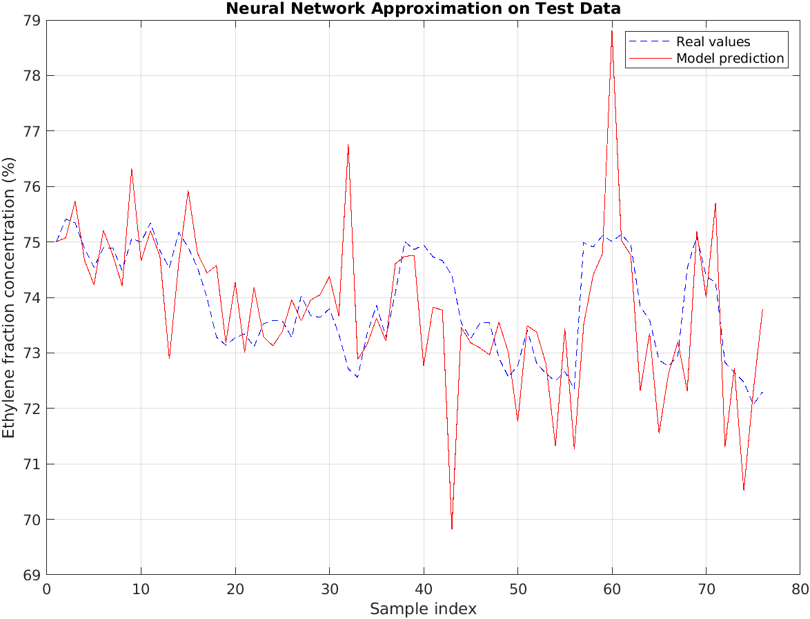
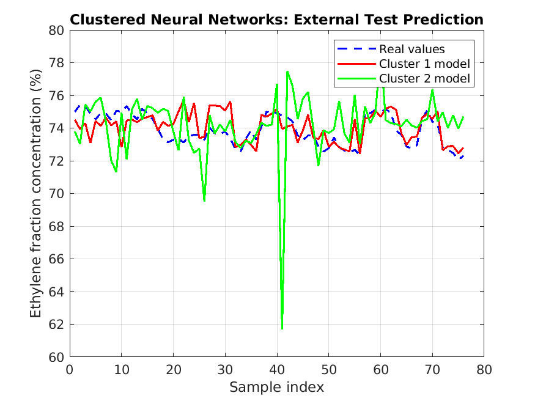
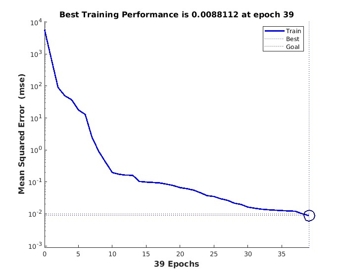

# Intelligent Industrial Data Analysis using Neural Networks and ANFIS in MATLAB

## Overview

This project presents a comparative study of intelligent data analysis methods for industrial process monitoring data related to low-temperature coke gas separation.

Several machine learning and neuro-fuzzy approaches were implemented and compared in MATLAB, including:

* fuzzy clustering (FCM and Subtractive Clustering),
* feedforward neural networks,
* ANFIS neuro-fuzzy systems,
* Neural Network Fitting App,
* hybrid clustered neural network models.

The goal of the project was to investigate nonlinear approximation of industrial process parameters and compare the effectiveness of different intelligent modeling approaches.

---

## Dataset

The dataset contains industrial process monitoring data from a low-temperature coke gas separation system.

### Input Features

* Temperature
* Valve opening percentage
* Coke gas flow
* Nitrogen flow

### Target Variable

* Ethylene fraction concentration

Two independent datasets were created:

* `coke_gas_train.csv`
* `coke_gas_test.csv`

The datasets were generated using non-overlapping sampling strategies to ensure reproducible external testing across all experiments.

---

## Implemented Methods

### 1. Data Preprocessing

* statistical analysis,
* polynomial approximation,
* spline interpolation,
* exploratory data analysis.

### 2. Fuzzy Clustering

* Fuzzy C-Means (FCM),
* Subtractive Clustering,
* membership matrix analysis,
* cluster center comparison.

### 3. Feedforward Neural Networks

* multilayer perceptrons,
* Levenberg–Marquardt training,
* train/test evaluation,
* architecture comparison.

### 4. ANFIS Neuro-Fuzzy Systems

* Sugeno FIS,
* Grid Partitioning,
* Subtractive Clustering initialization,
* neuro-fuzzy approximation.

### 5. Hybrid Clustered Neural Networks

* FCM-based data segmentation,
* separate neural network per cluster,
* local approximation of operating regimes.

### 6. MATLAB Neural Network Fitting App

* automatic train/validation/test split,
* regression analysis,
* validation performance analysis.

---

## Repository Structure

```text
data/
results/
scripts/
README.md
```

### Main folders

```text
results/
├── plots/
├── screenshots/
├── metrics/
└── models/

scripts/
├── preprocessing/
├── neural_networks/
├── hybrid_models/
└── anfis/
```

---

## Key Results

### Best Classical Neural Network

| Architecture | Goal | Epochs | Performance |
| ------------ | ---: | -----: | ----------: |
| 5-40         | 0.01 |     12 |     0.00207 |

### ANFIS Comparison

| Method                 | Test Error |
| ---------------------- | ---------: |
| Subtractive Clustering |     2.2645 |
| Grid Partitioning      |     4.6195 |

### Observations

* classical feedforward neural networks achieved the lowest approximation error,
* ANFIS models provided interpretable fuzzy-rule-based approximation,
* clustered neural networks demonstrated regime-based local modeling,
* early overfitting was observed in some automatic fitting experiments.

---

## Example Results

### Neural Network Test Prediction



### Clustered Neural Networks



### Neural Network Fitting Performance



---

## Technologies

* MATLAB
* Neural Network Toolbox
* Fuzzy Logic Toolbox
* ANFIS
* FCM Clustering
* Subtractive Clustering

---
